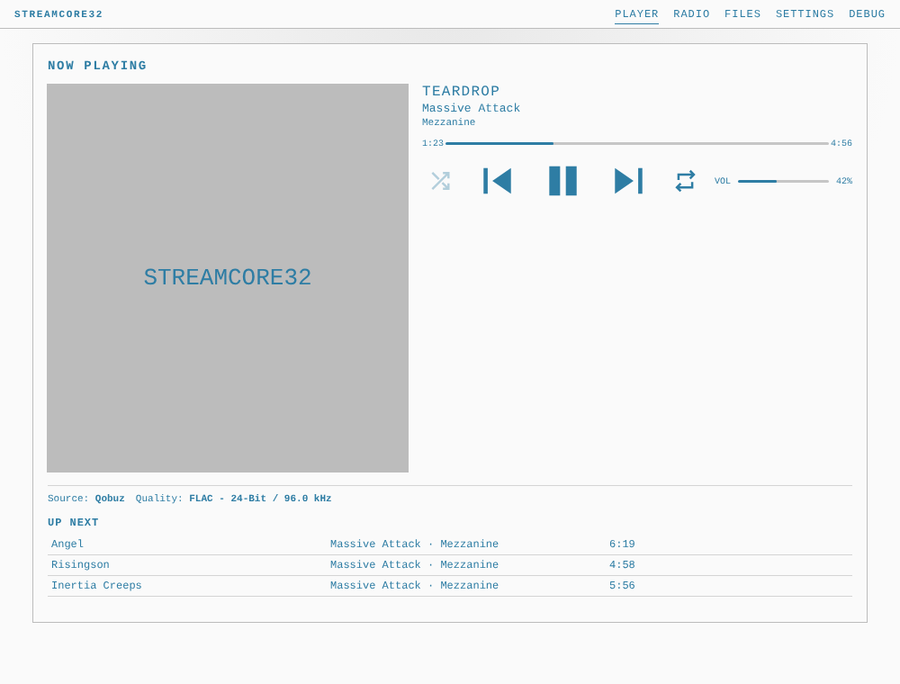
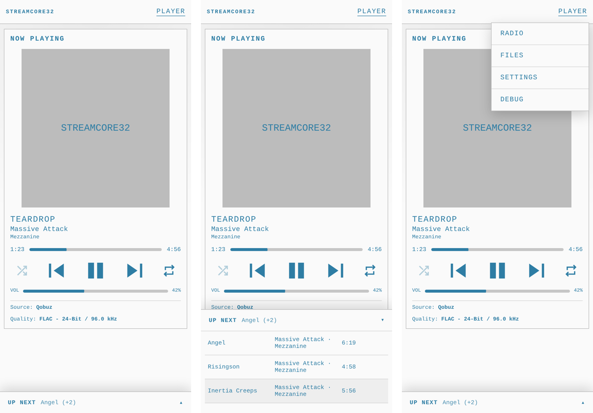
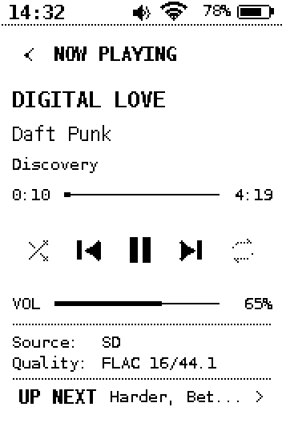
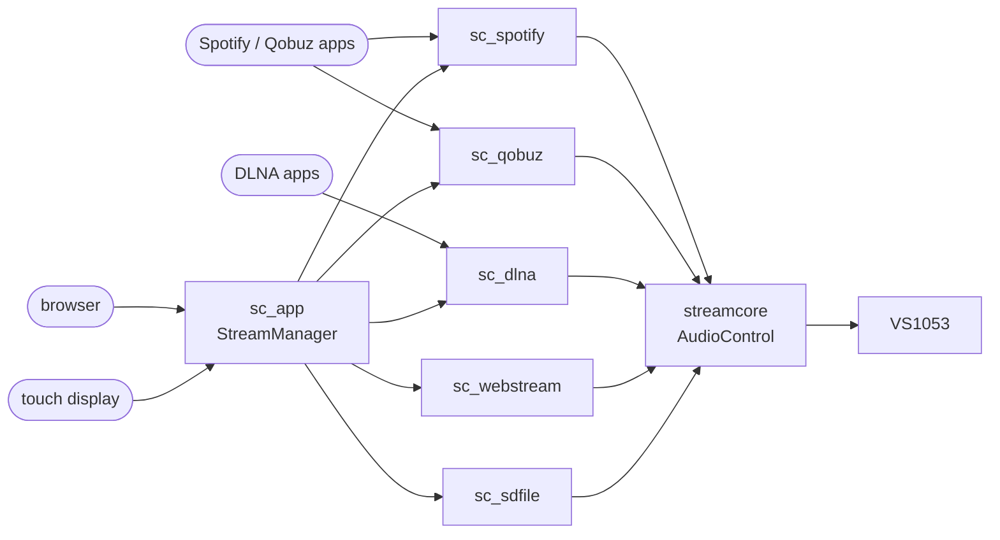

# StreamCore32

A network music player for the **ESP32-S3** with a **VS1063A** decoder:
**Spotify Connect**, **Qobuz Connect**, **DLNA / UPnP renderer**, internet
radio and SD card playback — controlled from the streaming apps, a web UI
that works on phones, and an optional 2.7" e-paper touch display.

Derived from [feelfreelinux/cspot](https://github.com/feelfreelinux/cspot).

| Web UI | Phone | E-paper |
|---|---|---|
|  |  |  |

> - Spotify needs a **Premium** account and the client ID / secret of a
>   Spotify developer app ([details](components/sc_spotify/README.md#spotify-developer-app)).
> - Qobuz plays only **30 s previews** without a paid subscription.

## Features

- **Spotify Connect** — Ogg Vorbis 96 / 160 / 320 kbps, queue, shuffle, repeat, seek, take-over from other devices
- **Qobuz Connect** — MP3 or FLAC up to 24 bit / 192 kHz, queue, autoplay, all apps in sync
- **DLNA / UPnP renderer** — BubbleUPnP, Hi-Fi Cast, foobar2000, Kodi, Plex / Jellyfin, Home Assistant ...; gap-less, seeking, LPCM
- **Internet radio** — station search (radio-browser.info), favourites, song titles (ICY or polled), playlists
- **SD card** — MP3, FLAC, WAV, Ogg, AAC, M4A, WMA, MIDI; gap-less, tags, seeking, M3U playlists, hot plug
- **Web UI** (`http://<device name>.local/`) — player, queue, radio, file manager (upload / download / playlists), settings, live log; phone layout
- **E-paper UI** — player, queue, radio, file browser, settings with on-screen keyboard; the web UI's look
- **One active source** — starting one stops the other; every source has the same controls, the UIs hide what a source can't do
- **Settings** stored on the device; bass / treble (VS10xx), status LED colours, dark mode
- **Crash reports** on the SD card (reason, panic output, last log lines)
- **Modular**: every part can be switched off in menuconfig — e.g. a headless build without display

## Hardware

Reference board: ESP32-S3 **N16R8** (16 MB flash, 8 MB octal PSRAM), VS1063A 
module, GoodDisplay GDEY027T91 2.7" e-paper with FT6336 touch, BQ27220 fuel
gauge, micro SD socket (SDMMC 1-bit), one SK6812 LED. Only the ESP32-S3 with
PSRAM and the VS1063A are required; all pins are set in menuconfig.

| Part | Default pins |
|---|---|
| VS1063A | SPI MOSI 5 · MISO 6 · CLK 4 · XCS 17 · XDCS 7 · XRESET 16 · DREQ 15 |
| SD card | CMD 13 · CLK 12 · D0 11 · card detect 14 |
| E-paper | SPI MOSI 41 · CLK 40 · CS 9 · DC 18 · RESET 48 · BUSY 47 |
| I2C (touch, gauge) | SDA 2 · SCL 1 · touch INT 3 · RESET 46 |
| Status LED | 8 |

## Build

Needs [ESP-IDF](https://github.com/espressif/esp-idf) **5.5** or newer and
the nanopb Python dependencies (protobuf code is generated during the build):

```shell
. $IDF_PATH/export.sh
pip install protobuf grpcio-tools

cd targets/esp32
idf.py set-target esp32s3        # once
idf.py menuconfig                # StreamCore32 → ...
idf.py build flash monitor
```

`mdns` and `led_strip` come from the ESP-IDF component manager on the first
build. There are no git submodules.

### Configuration

Everything is in one menu:

```
StreamCore32
  Device                        device name, default WiFi
  Streaming sources
    [*] Spotify Connect   --->  quality, stay visible, client id / secret
    [*] Qobuz Connect     --->  quality
    [*] Internet radio
    [*] SD card player          (needs the SD card)
    [*] DLNA / UPnP renderer -> HTTP port
  Hardware
    Audio output (VS1053) --->  pins, SPI bus, buffer
    [*] SD card           --->  pins
    [*] E-paper display   --->  pins, icon size
    [*]   Touch panel     --->  pins
    [*] Battery (BQ27220) --->  I2C address
    I2C bus               --->  pins (with touch or battery)
    [*] Status LED        --->  pin, mode, brightness
```

A part's options only appear when it is enabled; a disabled part is not
compiled. Without the e-paper display the firmware is **headless** (apps +
web UI); the web UI hides what is not built in.

Your `targets/esp32/sdkconfig` holds the WiFi password and the Spotify
secret — it is ignored by git. After an update that renames options, delete
it and configure again.

## First start

1. The device joins the WiFi from menuconfig (change it later in the web UI
   or on the display).
2. Open `http://<device name>.local/` (default `http://StreamCore32.local/`).
3. It appears in Spotify ("Devices available"), Qobuz (Connect) and DLNA apps
   under the device name. The first Spotify / Qobuz start takes a moment
   (ids are fetched and stored).

## Documentation

- [Architecture](docs/architecture.md) — overview diagram, stream interface,
  audio path, start-up, tasks
- [CHANGELOG](CHANGELOG.md)

| Component | |
|---|---|
| [streamcore](components/streamcore/README.md) | `StreamBase`, `AudioControl`, web UI server, zeroconf, logging, file probe |
| [sc_app](components/sc_app/README.md) | application, `StreamManager`, settings, WiFi, crash log, LED, UIs |
| [sc_spotify](components/sc_spotify/README.md) | Spotify Connect |
| [sc_qobuz](components/sc_qobuz/README.md) | Qobuz Connect |
| [sc_dlna](components/sc_dlna/README.md) | DLNA / UPnP renderer |
| [sc_webstream](components/sc_webstream/README.md) | internet radio |
| [sc_sdfile](components/sc_sdfile/README.md) | SD card player |
| [bell](components/bell/README.md) | networking, utilities, VS1053 driver (reduced feelfreelinux/bell) |
| [sc_sdcard](components/sc_sdcard/README.md) · [gdey027t91](components/gdey027t91/README.md) · [ft6x36](components/ft6x36/README.md) · [bq27220](components/bq27220/README.md) · [i2c_bus](components/i2c_bus/README.md) | hardware drivers |
| [eink_ui](components/eink_ui/README.md) · [eink_vg](components/eink_vg/README.md) · [Adafruit-GFX](components/Adafruit-GFX/README.md) | e-paper UI toolkit, vector icons, graphics |
| [targets/esp32](targets/esp32/README.md) | the ESP-IDF project |



## Development

- **E-paper UI on a PC**: [tools/scui_sim](tools/scui_sim/README.md) renders
  every page and checks the touch handling.
- **DLNA tests on a PC**: [tools/dlna_test](tools/dlna_test/README.md)
  (protocol against Home Assistant's DLNA library, HTTP reader, probe).
- **A new source**: derive from `StreamBase` — see
  [streamcore](components/streamcore/README.md#writing-a-new-source).
- Code style: `.clang-format` (Google based).

## Known limitations

- Spotify: event reporting is not supported, plays do not show up in
  "recently played". New Spotify developer apps cannot be created at the moment.
- No over-the-air update yet (the partition table already has two app slots).
- The web UI loads the Material Symbols font from Google Fonts (icons need
  internet access in the browser).

## Credits and license

StreamCore32 is licensed under the **GNU GPL v3** ([LICENSE.md](LICENSE.md)).

Built on [cspot](https://github.com/feelfreelinux/cspot) and
[bell](https://github.com/feelfreelinux/bell) by feelfreelinux and
contributors, with civetweb, nanopb, cJSON, nlohmann json (in `bell/external`),
the Adafruit GFX Library, the Inter and DejaVu fonts and feather icons — see
the licenses in the respective folders. Thanks to
[philippe44](https://github.com/philippe44) for the AccessKeyFetcher work.
