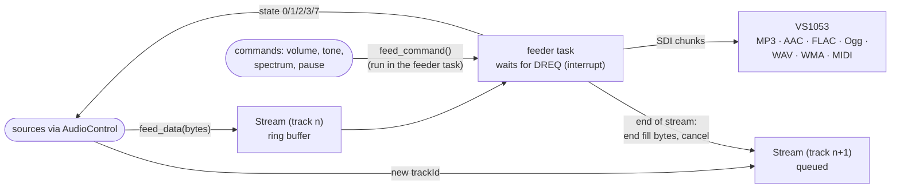

# bell (reduced)

This directory is a reduced copy of **bell** by feelfreelinux and contributors:

- upstream: https://github.com/feelfreelinux/bell
- license: MIT (see the licenses of the bundled libraries in `external/`)

It used to be a git submodule. StreamCore32 only needs a small part of it, so
only that part was copied (about 45 MB down to 3 MB).

## Kept

| Part | Files |
|---|---|
| network I/O | `main/io`: BellHTTPServer (civetweb), HTTPClient, SocketStream, TLSSocket, URLParser, X509Bundle, FileStream, picohttpparser |
| utilities | `main/utilities` (logger, tasks, crypto, buffers, ...) |
| platform | `main/platform/esp`, MDNSService.h, WrappedSemaphore.h |
| audio output | VS1053 driver (`main/audio-sinks/.../VS1053`, spectrum analyzer, patches) |
| external | civetweb, cJSON, nanopb (runtime + generator), nlohmann json |

## Removed

Codecs (opus, aac, mp3, alac, tremor) and the codec wrappers, DSP, audio
containers, fmt, mqtt, portaudio, the bell mDNS service and the apple / linux /
win32 platform layers. Decoding is done by the VS1053 (`BELL_NOCODEC`).

## Changes

- builds as an ordinary ESP-IDF component (`CMakeLists.txt`), options in
  `Kconfig.sc32` (menuconfig: StreamCore32 → Hardware → Audio output)
- `nanopb.cmake`: `sc32_nanopb_generate()` used by the streaming components to
  generate their protobuf sources
- StreamCore32 specific VS1053 changes (DREQ interrupt, feeder task, VS10xx
  user code)

## VS1053 sink

The decoder driver StreamCore32 plays everything through
(`main/audio-sinks/esp/VS1053.cpp`, `include/VS1053/`).

- Several streams can be queued; when one ends (end fill bytes for the
  format) the next starts — that is how the sources play gap-less.
- `feed_command()` runs register access in the feeder task, so SPI is
  never used from two tasks.
- VS10xx user code (plugin with the spectrum analyzer) is loaded at start.

### Configuration (menuconfig → StreamCore32 → Hardware → Audio output)

| Option | Default |
|---|---|
| XCS, XDCS, XRESET, DREQ | GPIO 17, 7, 16, 15 |
| SPI bus MOSI, MISO, CLK | GPIO 5, 6, 4 |
| Stream buffer size | 81920 bytes |
| Log decoder statistics | off (bitrate, format while playing) |
