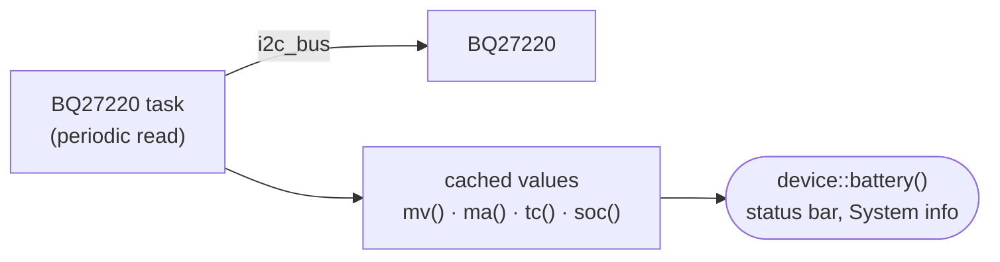

# bq27220

Driver for the TI **BQ27220** battery fuel gauge (I2C, address 0x55).
A small task reads (every second) voltage, current, temperature and state of charge; the
status bar of the display and the System info show them.

Enable: menuconfig → StreamCore32 → Hardware → **Battery (BQ27220)**.

| Method | |
|---|---|
| `mv()` | voltage in mV |
| `ma()` | current in mA (negative = discharging) |
| `tc()` | temperature in 0.1 °C |
| `soc()` | state of charge in 0.1 % |
| `read_*()` | direct register reads (`esp_err_t`) |

## Configuration

| Option | Default |
|---|---|
| I2C address | 0x55 |
| Log the values | off (prints the readings periodically) |

Uses the shared bus of [i2c_bus](../i2c_bus/README.md).
