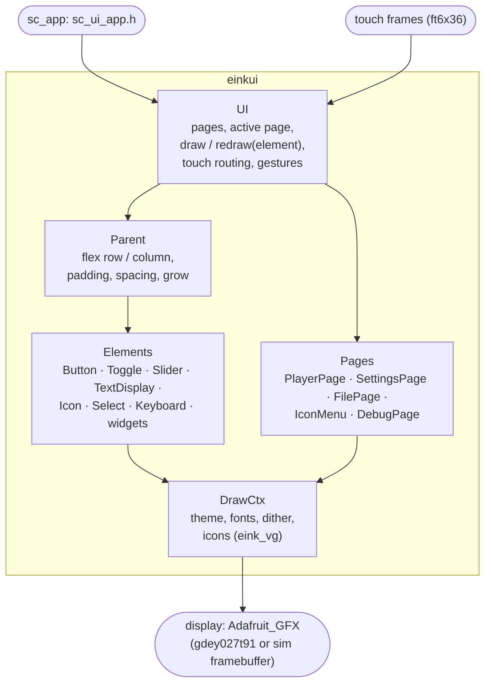

# eink_ui (einkui)

Header-only UI toolkit for small e-paper touch displays: flex layout,
elements, ready-made pages, partial refresh, touch handling. Display
independent (works with any `Adafruit_GFX`-like class) — the same code runs
on the device and in the PC simulator (`tools/scui_sim`).




## Concepts

- **`DrawCtx`** wraps the display (`makeDrawCtx(display)`): drawing
  primitives, text with a role (`TEXT_CAPTION`, `BODY`, `BOLD`, `TITLE`,
  `DISPLAY`, `MONO`), 1-bit "grey" dithering, hairlines, icons.
- **Theme** (`include/theme.h`): fonts per text role, corner radius, shadow,
  row height. `defaultTheme()` (Inter, rounded, hard shadows) and
  **`webTheme()`** (DejaVu Sans Mono, square, flat, titles in capitals — the
  look of the StreamCore32 web UI, used by the firmware).
- **Layout**: `Parent` is a flex container (`STYLE_DISPLAY_FLEX`,
  `STYLE_VERTICAL`, `flexGrow()`, `setPadding`, `setSpacing`, justify);
  `Grid` for tiles.
- **Refresh**: `ui.draw(ctx)` draws the page (full refresh),
  `ui.redraw(ctx, element)` only one element (partial refresh) — buttons,
  sliders, progress row, status bar.
- **Touch**: `ui.onTouchFrame(ctx, frame)`; the pressed element gets the
  focus until release (sliders follow the finger), swipe gestures.
- **Callbacks**: `element->cb().onTouchUp / onChange`.

## Contents

| | |
|---|---|
| `include/` | `ui.h`, `element.h` (Element, Parent, DrawCtx), `grid.h`, `theme.h`, `style.h`, `status_bar.h`, `circular_slider.h` |
| `elements/` | `button.h` (outline / filled / ghost / list row, dimmed state), `toggle.h`, `slider.h` (knob or bar, track thickness), `text_display.h` (ellipsis, auto shrink), `icon.h`, `select.h`, `keyboard.h` (on-screen, compact mode), `cartesian.h`, `widgets.h` (progress arc, badge, card, sparkline, divider, meter) |
| `pages/` | `player_page.h` (web-UI-style player: title / artist / album, time · bar · time, shuffle · prev · play · next · repeat, volume, source / quality, "up next" bar), `settings_page.h`, `file_page.h`, `menu_page.h` (icon tiles), `debug_page.h` (log) |
| `fonts/` | Inter (default theme) and DejaVu Sans Mono (web theme) as GFX fonts, Latin-1 |
| `tools/ttf2gfx.py` | TTF → GFX font header (1-bit FreeType hinting): `python3 tools/ttf2gfx.py DejaVuSansMono.ttf 12 einkui_web_body > fonts/einkui_web_body.h` |

## Minimal example

```cpp
#include "einkui.h"
using namespace einkui;

UI ui;
DrawCtx ctx = makeDrawCtx(display);
ctx.theme = &webTheme();

auto page = std::make_shared<Parent>("main", STYLE_DISPLAY_FLEX | STYLE_VERTICAL);
auto* b = page->add(new Button("&ui_play Play", 0, 40)).get();
b->onTap([](void*, Element*) { /* ... */ });
ui.addPage(page);
ui.setPage(page);
ui.draw(ctx);
// touch task: ui.onTouchFrame(ctx, frame);
```

Labels starting with `&` are icons from [eink_vg](../eink_vg/README.md)
(`"&ui_play"`, or `"&wifi Connect"` for icon + text).

## Licenses

Fonts: Inter (SIL OFL, `fonts/LICENSE-Inter.txt`), DejaVu (`fonts/LICENSE-DejaVu.txt`).
