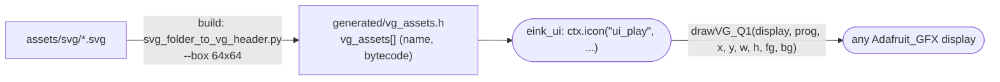

# eink_vg

A tiny, **header-only** “VG_Q1” vector renderer for e-paper / embedded displays.

- Converts simple SVG files into a compact, **2-color** vector bytecode format (“VG_Q1”).
- Decodes VG_Q1 byte streams and renders them onto any display class with **Adafruit_GFX-like** primitives.



In StreamCore32 the icons of the e-paper UI (feather icons plus a few `ui_*`
icons) come from here; an element label `"&name"` draws icon `name`.

---

## Public API

Include the headers:

```cpp
#include "eink_vg.h"   //for drawVG_Q1
#include "vg_assets.h" //for vg_assets[] and vg_asset_t

```
### Assets

Generated assets are emitted as:
- ``vg_asset_t vg_assets[]`` (name + pointer + length), and/or
- a static byte array named ``/*name*/_vg``

``vg_asset_t`` is defined as: ``typedef struct { const char* name; const uint8_t* data; size_t len; } vg_asset_t;``

Put SVG icons in `assets/svg/`.

During the build, CMake runs a [Python tool](tools/svg_folder_to_vg_header.py) that generates:

```
<build>/.../generated/vg_assets.h
```

### Tweaking the output size

The converter is called with `--box 64x64` by default. In StreamCore32 the
size is set in menuconfig → StreamCore32 → Hardware → E-paper display →
*Icon box width / height* (`CONFIG_EINK_VG_BOX_W/H`).

---

## Converter limitations / tips

- The bytecode renderer is **2-color** (palette0/palette1). The converter maps SVG colors to index 0/1 by **luma**.
- Each SVG element is rendered with a single `colorIndex` (fill and stroke share the same index for that element).
- Keep SVGs simple (icons/logos). Text is ignored.

---

### `drawVG_Q1()`

```cpp
template <class DisplayT>
bool drawVG_Q1(
    DisplayT& d,
    const uint8_t* prog,
    int16_t dx, int16_t dy, int16_t dw, int16_t dh,
    uint16_t palette0, uint16_t palette1
);
```

- **`prog`**: pointer to a VG_Q1 bytecode program.
- **`dx,dy,dw,dh`**: destination rectangle on your display.
- **`palette0 / palette1`**: the two colors used by the program (colorIndex **0** maps to `palette0`, **1** maps to `palette1`).
- Returns **`true`** if the program decoded successfully, **`false`** on invalid/unknown opcodes or malformed header.

### Display requirements

`DisplayT` must provide these Adafruit_GFX-style drawing primitives:

- `drawLine(x0,y0,x1,y1,color)`
- `drawFastHLine(x,y,w,color)`
- `fillRect(x,y,w,h,color)` and `drawRect(x,y,w,h,color)`
- `fillRoundRect(x,y,w,h,r,color)` and `drawRoundRect(x,y,w,h,r,color)`
- `fillCircle(x,y,r,color)` and `drawCircle(x,y,r,color)`

---

## How the bytecode works

A VG_Q1 program is a stream of opcodes:

- Starts with **`OP_VIEWBOX`** followed by `vbW,vbH` (`uint16` each)
- Followed by any number of drawing ops
- Ends with **`OP_END`**

Coordinates are `int16` in “viewBox units” and are scaled into the destination rectangle using
**preserveAspectRatio = xMidYMid meet** (uniform scale + centered).

### Opcodes

| Opcode | Payload | Meaning |
|---|---|---|
| `OP_VIEWBOX` | `u16 vbW, u16 vbH` | Declares the source coordinate system |
| `OP_STYLE` | `u8 flags, u8 strokeW, u8 colorIndex` | Enables fill/stroke + stroke width + palette index |
| `OP_LINE` | `s16 x0,y0,x1,y1` | Draw line (stroke-only behavior) |
| `OP_RECT` | `s16 x,y,w,h,rx` | Rect / round-rect (rx = corner radius) |
| `OP_CIRCLE` | `s16 cx,cy,r` | Circle |
| `OP_POLY` | `u8 n, u8 pflags, n*(s16 x,y)` | Polyline / polygon (`POLY_CLOSED` => polygon) |
| `OP_END` | – | End of stream |

### Style flags

- `STYLE_FILL` (0x01): fill shapes
- `STYLE_STROKE` (0x02): stroke outlines
- `strokeW`: thickness (1..255), implemented by drawing multiple offset lines.
- `colorIndex`: **0** uses `palette0`, **1** uses `palette1`.

---

## Notes / limitations

- `OP_POLY` fill uses a scanline filler with a fixed internal cap of **128 points**.
- The style carries only **one** `colorIndex` for both fill and stroke (per element). Use separate SVG elements if you need multiple colors.
- The standalone repository ([tobiasguyer/eink_vg](https://github.com/tobiasguyer/eink_vg)) also has an ESP-IDF example.
