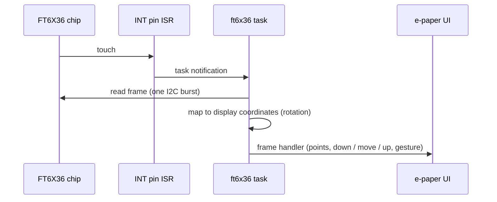

# ft6x36

Driver for the **FT6236 / FT6336** capacitive touch controller (I2C) of the
GDEY027T91 display. Interrupt driven: a small task reads a whole frame
(points, events, gesture) when the INT pin fires and hands it to the UI.

Enable: menuconfig → StreamCore32 → Hardware → E-paper display → **Touch
panel** (only with the display).

| | |
|---|---|
| `FT6X36(intPin, &bus)` | on the shared [i2c_bus](../i2c_bus/README.md) |
| `begin(threshold, width, height)` | init, start the task |
| `registerFrameHandler(fn)` | full frames (used by the UI) |
| `registerTouchHandler(fn)` | simple point + event callback |
| `setPollPeriodMs()` | polling when there is no INT pin |

## Configuration

| Option | Default |
|---|---|
| INT | GPIO 3 |
| RESET | GPIO 46 |

Based on the FT6X36 driver of
[lvgl_esp32_drivers](https://github.com/lvgl/lv_port_esp32/tree/master/components/lvgl_esp32_drivers/lvgl_touch).
