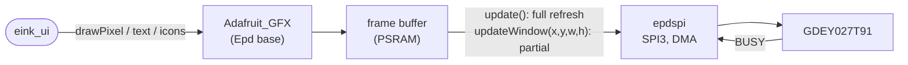

# gdey027t91

Driver for the **GoodDisplay GDEY027T91** 2.7" e-paper (176 × 264, black /
white) on SPI. An `Adafruit_GFX` display: the UI
draws into a frame buffer, then the panel is refreshed fully or partially.

Enable: menuconfig → StreamCore32 → Hardware → **E-paper display**. Without
it the firmware is *headless* (web UI + apps only).

| | |
|---|---|
| `init()` | reset, power up, full-update mode |
| `update()` | full refresh (slow, clears ghosting) |
| `updateWindow(x, y, w, h)` | partial refresh of one area (fast, used for buttons, sliders, progress, status bar) |
| `setMonoMode()` | 1-bit mode |

## Configuration

| Option | Default |
|---|---|
| CS, DC, RESET, BUSY | GPIO 9, 18, 48, 47 |
| SPI MOSI, CLK | GPIO 41, 40 |
| Vector icon box (`eink_vg`) | 64 × 64 |

Based on the CalEPD driver structure (`epd`, `epdspi`) by Martin Fasani.
