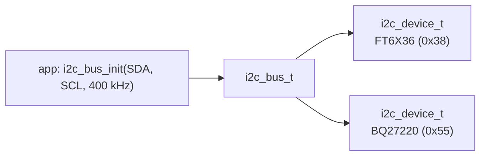

# i2c_bus

A thin C wrapper around the ESP-IDF 5 I2C master driver, so several drivers
share one bus: the touch controller ([ft6x36](../ft6x36/README.md)) and the
fuel gauge ([bq27220](../bq27220/README.md)).

The menu appears only when one of them is enabled:
menuconfig → StreamCore32 → Hardware → **I2C bus** (SDA GPIO 2, SCL GPIO 1).

| Function | |
|---|---|
| `i2c_bus_init(&bus, sda, scl, hz)` / `i2c_bus_deinit` | create the master bus |
| `i2c_device_init(&dev, &bus, addr, timeout_ms)` / `i2c_device_deinit` | add a device |
| `i2c_reg_read_u8`, `i2c_reg_write_u8` | 8-bit register access |
| `i2c_reg_read_u16_le`, `i2c_reg_write_u16_le` | 16-bit little-endian registers |
