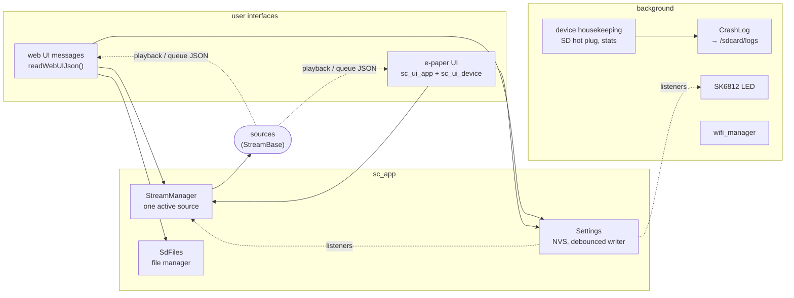

# sc_app

The StreamCore32 application. `targets/esp32/main/main.cpp` only calls
`sc32_app_main()`; this component starts the hardware and the sources that
are enabled in menuconfig and connects them to the two user interfaces.

## Files

| File | |
|---|---|
| `app.cpp` | Start-up order, source creation, web UI message handler (`cmd`, `settings.*`, `wifi.connect`, `radio.cmd`, `sd.cmd`, `fs.*`/`pl.*`, `page`), spectrum broadcast (UDP 6969), mDNS. |
| `StreamManager.h` | Owns the sources; `activate(service)` stops the previous one, `active()` is what every control goes to. Convenience: `playStation`, `playFile`, `playFolder`, `playPlaylist`. |
| `Settings.h/.cpp` | All user settings (device name, services on/off, qualities, volume, tone, dark mode, LED, spectrum). `update()` changes RAM at once, notifies listeners, and a debounced write runs on the settings task (internal stack). `runLater()` runs flash work there for tasks with a PSRAM stack. `toJson()` / `applyJson()` for the web UI. |
| `device.h/.cpp` | Services that exist with or without a display: station list, SD info / remount, battery, WiFi info, system info rows, housekeeping task. |
| `CrashLog.h/.cpp` | Why did the device restart? Console output is copied into a RAM ring that survives a reset; the panic output and the core dump summary are added; after the next boot `/sdcard/logs/boot.log` and `crash-NNNN.txt` are written. |
| `SdFiles.h/.cpp` | File manager behind the web UI's Files page (list, mkdir, move, delete, read / write text, M3U playlists) plus streamed upload / download over HTTP. |
| `wifi_manager.h/.cpp` | Station mode, reconnects, credentials in NVS, connect / switch / disconnect callbacks. |
| `SK6812.h/.cpp` | One addressable LED (RMT): colour and effect per state, modes off / startup / WiFi / all. |
| `NvsCreds.h/.cpp` | Encrypted credential stores (`SecureStore`) for Spotify / Qobuz logins and the plain `Store` for the station list. |
| `sc_ui_model.h` | What the e-paper UI needs (`scui::Backend`): playback, queue, stations, files, WiFi, settings. No FreeRTOS / bell dependency. |
| `sc_ui_app.h` | The e-paper UI itself (pages, layout, partial refresh policy), hardware independent: also runs in `tools/scui_sim`. |
| `sc_ui_device.h/.cpp` | Device side of it: implements the backend on `StreamManager` / `device::`, runs the UI task, touch input, dark mode. Built only with the display. |
| `sc_app.h` | `sc32_app_main()` and `sc32::kHas*` constants (which parts are built). |

## Settings

| Setting | Default | Applied |
|---|---|---|
| Device name (Spotify, Qobuz, DLNA, mDNS `http://<name>.local/`) | `CONFIG_SC32_DEVICE_NAME` | after restart |
| Spotify Connect / Qobuz Connect / DLNA renderer on/off | on | after restart |
| Spotify quality 96 / 160 / 320 kbps | `CONFIG_SPOTIFY_AUDIO_FORMAT` | next connection |
| Qobuz quality MP3 / CD / Hi-Res 96k / Hi-Res 192k | `CONFIG_QOBUZ_AUDIO_FORMAT` | next track |
| Radio: reconnect after a pause longer than n s | 10 s | at once |
| Volume (kept after a restart), bass / treble | 50 % / flat | at once |
| Display dark mode | off | at once |
| Status LED mode, brightness, colour + effect per state | menuconfig | at once |
| Spectrum broadcast (UDP 6969) | off | at once |

## Web UI messages (WebSocket, JSON)

| `type` | |
|---|---|
| `cmd` | `{"cmd":"play\|pause\|toggle\|next\|prev\|seek\|seek_percent\|set_volume\|shuffle\|repeat\|play_index",...}` → active source (`StreamBase::handleCommand`) |
| `settings.get` / `settings.set` | `{"values":{"device_name":"Kitchen",...}}` |
| `wifi.connect` | `{"ssid":"..","password":".."}` |
| `radio.cmd` | `play_station`, `save_station`, `remove_station` |
| `sd.cmd` | `play`, `play_folder`, `play_playlist` |
| `fs.*`, `pl.*` | file manager (see `SdFiles.h`) |
| `system.restart`, `display.refresh`, `page` | |

Outgoing: `playback`, `queue`, `settings` (with `features`: what this
firmware was built with), `radio`, `debug`, log lines.

## Configuration

menuconfig → StreamCore32 → **Device** (`Kconfig.sc32`): device name,
default WiFi. **Hardware → Status LED** (`Kconfig.led`): pin, default mode,
brightness.
