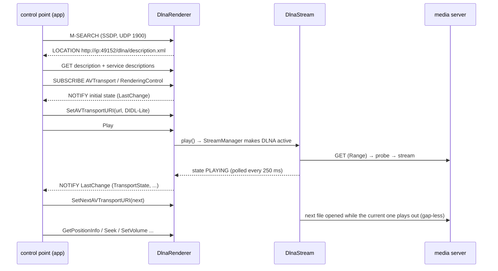
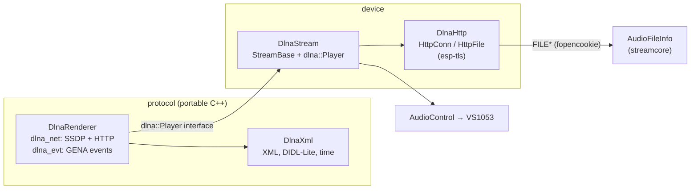

# sc_dlna

DLNA / UPnP AV **MediaRenderer**: the device shows up as a speaker in DLNA
apps (BubbleUPnP, Hi-Fi Cast, foobar2000, JRiver, Kodi, mconnect, Plex /
Jellyfin / Emby clients, Home Assistant, ...), which send it music from a
media server or the phone.

Enable: menuconfig → StreamCore32 → Streaming sources → **DLNA / UPnP
renderer** (option: HTTP port, default 49152). Can be switched off in the
settings.

## Protocol

| | |
|---|---|
| Discovery | SSDP on UDP 1900 (M-SEARCH answers, NOTIFY alive / byebye, re-announced when the IP changes) |
| HTTP | own small server on `CONFIG_SC32_DLNA_PORT`: `/dlna/description.xml`, `/dlna/<Service>.xml`, `/dlna/<Service>/control`, `/dlna/<Service>/event` |
| AVTransport:1 | SetAVTransportURI, **SetNextAVTransportURI**, Play, Pause, Stop, Seek (REL_TIME / ABS_TIME / TRACK_NR), Next, Previous, GetMediaInfo, GetTransportInfo, GetPositionInfo, GetDeviceCapabilities, GetTransportSettings, SetPlayMode, GetCurrentTransportActions |
| RenderingControl:1 | GetVolume / SetVolume, GetMute / SetMute, ListPresets / SelectPreset |
| ConnectionManager:1 | GetProtocolInfo, GetCurrentConnectionIDs, GetCurrentConnectionInfo |
| Events | GENA SUBSCRIBE / renew / UNSUBSCRIBE; LastChange for AVTransport and RenderingControl (only what changed, at most 5 per second) |
| Formats | MP3, AAC / M4A, FLAC, Ogg Vorbis, WAV, WMA, MIDI, **LPCM** (`audio/L16`: gets a WAV header, bytes swapped) |

## Playback

- Files from a server that supports Range requests are probed like SD card
  files: exact duration, quality, **seeking**.
- Live streams (no length) play front to back and reconnect when dropped.
- http and https (certificate bundle), redirects, chunked bodies.
- The device UI and web UI control a DLNA stream like any other source.
- When another source takes over, the control point sees **paused** (not
  stopped, which would make it skip to its next track); its Play button
  takes the device back and continues there.
- Volume set by a control point only applies while DLNA is the active source.

## Files

| File | |
|---|---|
| `DlnaRenderer.h/.cpp` | SSDP, descriptions (generated SCPDs), SOAP actions, GENA subscriptions and events. Talks to a `dlna::Player`. |
| `DlnaStream.h/.cpp` | The player: `StreamBase` + `dlna::Player` (adapter), reader task, gap-less chaining, position clock, takeover handling. |
| `DlnaHttp.h/.cpp` | `HttpConn` (one GET on esp-tls; redirects, chunked, until-close bodies, Range) and `HttpFile` (reads at positions, reconnects, 64 KB head cache, `FILE*` for the probe). |
| `DlnaXml.h/.cpp` | Escaping, tag / attribute search, DIDL-Lite parsing, UPnP time format. |

## Tests (PC)

`tools/dlna_test/run_tests.sh` — the protocol is tested with a fake player
against [async-upnp-client](https://github.com/StevenLooman/async_upnp_client)
(the DLNA library of Home Assistant) and raw SSDP; the HTTP reader and the
probe against a local server with Range, redirects, chunked, live and
dropped connections, using real FLAC / MP3 / Ogg / M4A / WAV files.
