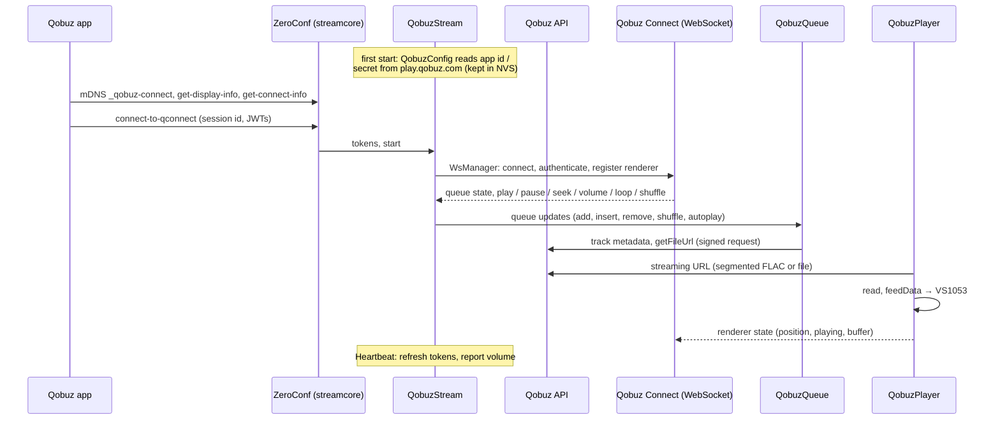
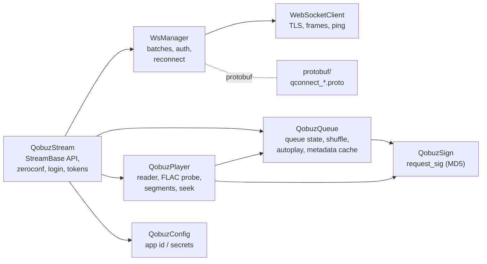

# sc_qobuz

Qobuz Connect receiver: the device shows up in the Qobuz apps as a speaker
and plays MP3 or FLAC up to 24 bit / 192 kHz (decoded by the VS1053).

> Without a paid Qobuz subscription Qobuz only plays 30 second previews.

Enable: menuconfig → StreamCore32 → Streaming sources → **Qobuz Connect**.

## How it works

## Files

| File | |
|---|---|
| `QobuzStream.h/.cpp` | The source: zeroconf endpoints, tokens, Qobuz Connect messages (`WSDecodeMessage`), `StreamBase` control API (pause, seek, next / previous, shuffle and repeat as controller commands so all apps stay in sync, volume, queue). |
| `QobuzQueue.h`, `QubuzQueue.cpp` | Mirror of the Qobuz Connect queue (incl. shuffle order and autoplay), track metadata, file URLs, upcoming tracks for the UIs. |
| `QobuzPlayer.h/.cpp` | Reads the audio (whole file or segmented stream), keeps position, reports the renderer state. |
| `QobuzTrack.h` | Track / album / artist data, segment URL helper. |
| `QobuzConfig.h/.cpp` | Finds the web player's app id and secrets (bundle on play.qobuz.com); runs once, the result is stored. |
| `QobuzSign.h/.cpp` | `request_sig` for signed API calls. |
| `WsManager.h`, `WebSocketClient.h/.cpp` | WebSocket client (TLS) with keep-alive, batching and token refresh. |
| `protobuf/` | Qobuz Connect message definitions (nanopb, generated at build time). |

## Configuration

| Option | |
|---|---|
| Default audio quality | MP3 320 · FLAC CD · FLAC hi-res ≤ 96 kHz · FLAC hi-res ≤ 192 kHz (also in the settings, applied from the next track) |

Qobuz Connect can be switched off in the settings (saves RAM).
