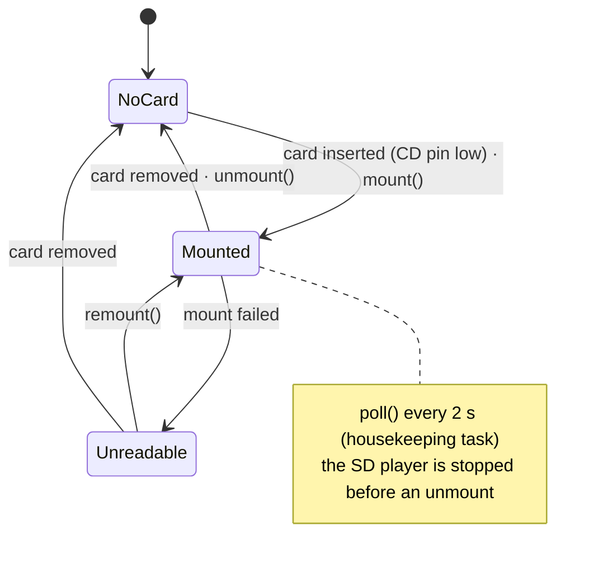

# sc_sdcard

micro SD card on the SDMMC peripheral (1-bit bus), FAT mounted at `/sdcard`.
Used by the SD player, the web UI file manager, playlists and the crash log.

Enable: menuconfig → StreamCore32 → Hardware → **SD card**.

| | |
|---|---|
| `mount()` / `unmount()` / `remount()` | thread safe |
| `poll()` | hot plug: mounts a fresh card, unmounts a removed one; returns true when the state changed |
| `info()` | present / mounted, card name, type, size, free space |
| `kMountPoint` | `/sdcard` |

## Configuration

| Option | Default |
|---|---|
| CMD, CLK, D0 | GPIO 13, 12, 11 |
| Card detect | GPIO 14 (closes to GND with a card; -1 = no detect pin, the card is then only checked by mounting) |
