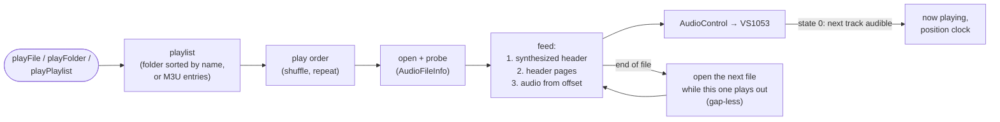

# sc_sdfile

Plays audio files from the SD card: MP3, FLAC, WAV, Ogg Vorbis, AAC, M4A
(AAC / ALAC), WMA and MIDI — the VS1053 decodes, this source reads and feeds.

Enable: menuconfig → StreamCore32 → Streaming sources → **SD card player**
(needs *Hardware → SD card*).

## Features

- **Playlist**: playing a file plays its folder from there; folders and M3U
  playlists (`/sdcard/Playlists`, relative paths so they work on a PC too,
  managed in the web UI's Files page).
- **Gap-less**: the next file is fed while the current one plays out.
- **Tags**: ID3v1/v2, FLAC / Ogg Vorbis comments, MP4, RIFF INFO; duration,
  quality ("FLAC · 16-bit / 44.1 kHz").
- **Seeking**: FLAC, MP3 (Xing TOC for VBR), WAV, Ogg, AAC — the decoder
  header is re-sent, then the file continues at the computed offset.
  MP4 / WMA / MIDI play front to back.
- Shuffle, repeat (off / all / one), queue, previous (restart if > 3 s).
- A removed card stops playback before the card is unmounted.

## Files

| File | |
|---|---|
| `SDFileStream.h/.cpp` | The source: playlist, play order, reader task, sink state handling, M3U read / write. |

The file probe (`AudioFileInfo`) lives in [streamcore](../streamcore/README.md),
the card driver in [sc_sdcard](../sc_sdcard/README.md).
