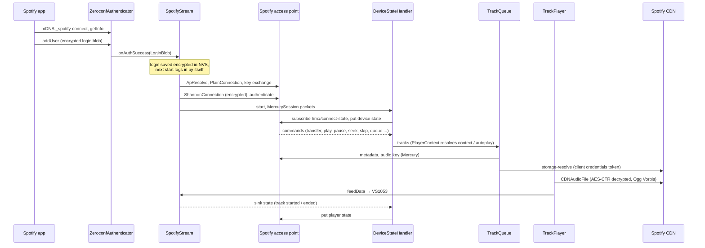
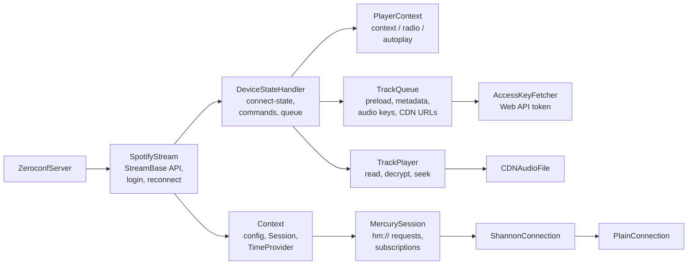

# sc_spotify

Spotify Connect receiver. Derived from
[feelfreelinux/cspot](https://github.com/feelfreelinux/cspot); the session,
connect-state and track queue were reworked for StreamCore32 and the
`StreamBase` control API was added (`SpotifyStream`).

> Needs a **Spotify Premium** account and the client ID / secret of a Spotify
> developer app (see below).

Enable: menuconfig → StreamCore32 → Streaming sources → **Spotify Connect**.

## How it works

## Files

| File | |
|---|---|
| `SpotifyStream.h` | The source: zeroconf, stored login, connects / reconnects, `StreamBase` control API (pause, seek, next, shuffle, repeat, volume, queue) mapped to Spotify commands. |
| `ZeroConfServer.h`, `LoginBlob` | `_spotify-connect` mDNS service and the getInfo / addUser endpoints; decrypts the login blob. |
| `ApResolve`, `PlainConnection`, `AuthChallenges`, `Shannon*`, `Session` | Access point lookup, Diffie-Hellman key exchange, Shannon stream cipher, authentication. |
| `MercurySession` | Spotify's request / subscription protocol on the encrypted connection (`hm://...`), audio key requests. |
| `DeviceStateHandler` | Spotify Connect state machine: device / player state, remote commands, track list, queue snapshot for the UIs. |
| `PlayerContext` | Resolves contexts (album, playlist), radio and autoplay. |
| `TrackQueue`, `TrackReference` | Preloads tracks: metadata, audio key, file URL. |
| `TrackPlayer`, `CDNAudioFile` | Streams one connection per track from the CDN, decrypts (AES-CTR) and feeds the decoder; seeking. |
| `AccessKeyFetcher` | Web API token (client credentials) for `storage-resolve`. |
| `EventManager`, `TimeProvider` | Playback metrics, server time. |
| `protobuf/` | Protocol definitions (nanopb, generated at build time). |

## Configuration

| Option | |
|---|---|
| Default audio quality | Ogg Vorbis 96 / 160 / 320 kbps (also in the settings) |
| Stay visible while connected | keep the mDNS announcement so another phone can take over |
| Client ID / secret | of your Spotify developer app (required) |

Spotify Connect can be switched off in the settings (saves RAM).

## Spotify developer app

Spotify currently does not allow creating new developer apps. If you have
one (or a friend does), use its client ID and secret; an app is limited to
5 users.

1. Developer Dashboard → *Create an App* (name, description, accept the terms).
2. App → *Settings* → *User Management* → *Add new user*: name and e-mail of
   each Spotify account that will use the device.
3. App overview: copy the *Client ID*, *View client secret* → copy the secret.
4. Enter both in menuconfig.

Reference: [Spotify quota modes](https://developer.spotify.com/documentation/web-api/concepts/quota-modes).
Thanks to [philippe44](https://github.com/philippe44) for adapting the
AccessKeyFetcher to the new API restrictions.

## Known limitations

- Event reporting (event-service/v1) is not supported any more: tracks played
  here do not show up in "recently played".
