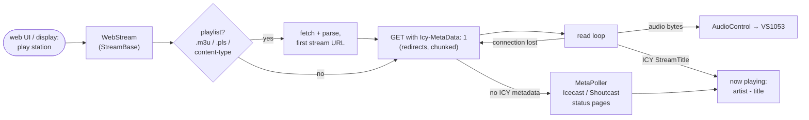

# sc_webstream

Internet radio. Plays MP3 / AAC / Ogg / FLAC streams over HTTP(S), shows the
song title, and steps through the saved station list.

Enable: menuconfig → StreamCore32 → Streaming sources → **Internet radio**.

## Behaviour

- **Stations**: the list saved in the web UI (Radio page, search via
  radio-browser.info) is the queue; next / previous step through it.
- **Pause**: a live stream cannot really pause; reading stops and the sink
  pauses. After more than *n* seconds (setting "Radio: reconnect after a
  pause longer than", default 10 s) resume reconnects, so you are live again.
- **Metadata**: ICY in-stream titles; if a station sends none, `MetaPoller`
  polls the server's status page (Icecast JSON, Shoutcast JSON / 7.html).
- **Quality** shown from the stream headers (codec, bitrate, sample rate).
- Reconnects after an unexpected end of the stream.

## Files

| File | |
|---|---|
| `WebStream.h` | The source: playlist resolving, ICY parsing, chunked bodies, station list, `StreamBase` control API. |
| `MetaPoller.h/.cpp` | Background poller for stations without ICY metadata. |
| `UrlOrigin.h` | URL helpers for the poller. |
