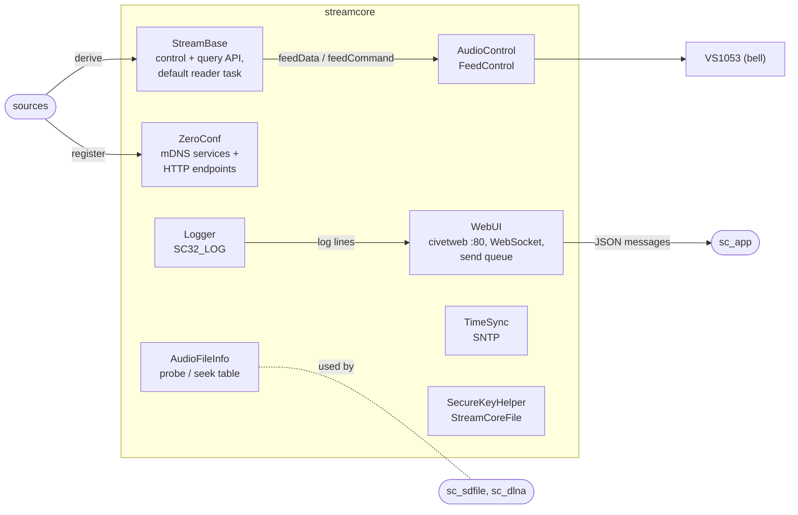

# streamcore

The core every other StreamCore32 component builds on: the common stream
interface, the bridge to the audio decoder, the web UI server, zeroconf and
the small services (logging, time, credential storage, file probe).

Always built. The root menu **StreamCore32** of menuconfig is defined here
(`Kconfig.projbuild`); it collects the `Kconfig.sc32` files of the other
components.



## Parts

| File | |
|---|---|
| `StreamBase.h` | Base class of all sources (a `bell::Task`). Control API (`pause/resume/next/previous/seek/setShuffle/setRepeat/setVolume/getQueue/playQueueItem`), state (`nowPlaying()`, `capabilities()`), UI glue (`nowPlayingJson()`, `queueJson()`, `handleCommand(json)`), and a simple default reader for plain HTTP streams. Every method has a safe default. |
| `AudioControl.h/.cpp` | Owns the VS1053 sink. `FeedControl::feedData(buf, len, trackId)` queues audio, a new `trackId` starts a new (gap-less) stream; `feedCommand(PLAY/PAUSE/FLUSH/DISC/SKIP/VOLUME_*)`; `state_callback` reports 0 start · 1/2 playing · 3 paused · 7 ended. |
| `WebUi.h` | The web UI: page, style and script embedded as strings, served by civetweb on port 80. One WebSocket endpoint; all outgoing messages go through a queue and one sender task, so a slow browser never blocks a stream task. Pages: Player, Radio, Files, Settings, Debug. Works on phones (dropdown menu, queue bar). Elements with `data-feature` are hidden when the firmware is built without that part. |
| `ZeroConf.h/.cpp` | `ZeroconfServiceManager`: registers mDNS services (`_spotify-connect`, `_qobuz-connect`, ...) and their HTTP endpoints on one small server (port 7864). |
| `Logger.h` | `SC32_LOG(level, fmt, ...)`: bell logger + copy to the web UI log. |
| `TimeSync.h` | SNTP start, `wait_until_valid()`, epoch helpers (Qobuz request signatures need the time), Swiss time zone. |
| `SecureKeyHelper.*`, `StreamCoreFile.h` | Device key derived from the MAC (encrypts stored credentials), record / field interface of the credential stores. |
| `AudioFileInfo.h/.cpp` | Reads only headers of an audio file (`FILE*`): codec, duration, sample rate, bit depth, tags (ID3v1/v2, Vorbis comments, MP4, RIFF INFO) and what is needed to start in the middle (FLAC STREAMINFO, Ogg header pages, WAV header, MP3 Xing TOC). Pure C++, tested on a PC. |
| `EspRandomEngine.h` | `std::` random engine on the hardware RNG. |
| `Heartbeat.h` | Periodic task helper (Qobuz keep-alive). |

## Writing a new source

```cpp
class MyStream : public StreamBase {
 public:
  explicit MyStream(std::shared_ptr<AudioControl> a) : StreamBase("My", a) {}
  const char* sourceName() const override { return "My"; }
  Capabilities capabilities() override { Capabilities c; c.pause = true; return c; }
 protected:
  void runTask() override {
    size_t tid = audio_->makeUniqueTrackId();
    while (!wantStop_.load()) {
      int n = /* read */;
      feed_->feedData(buf, n, tid);          // returns how much was taken
    }
  }
};
```

Register it in `sc_app` (`StreamManager` + `attach()`), and both UIs work with it.

## Configuration

`Kconfig.projbuild` only builds the menu tree; the options are in the
components' own `Kconfig.sc32` files.
