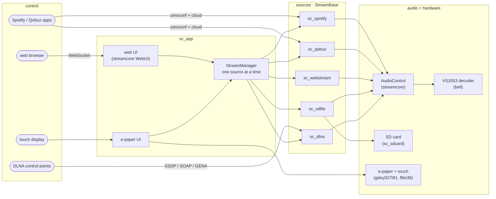
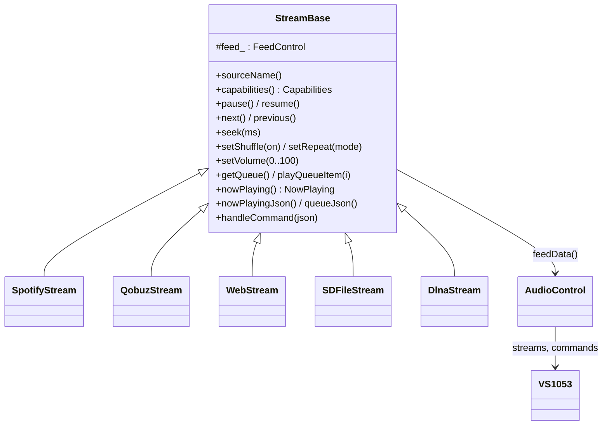
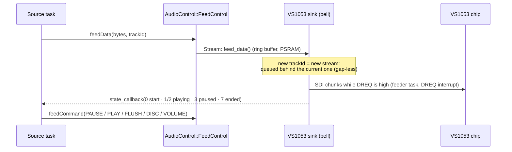
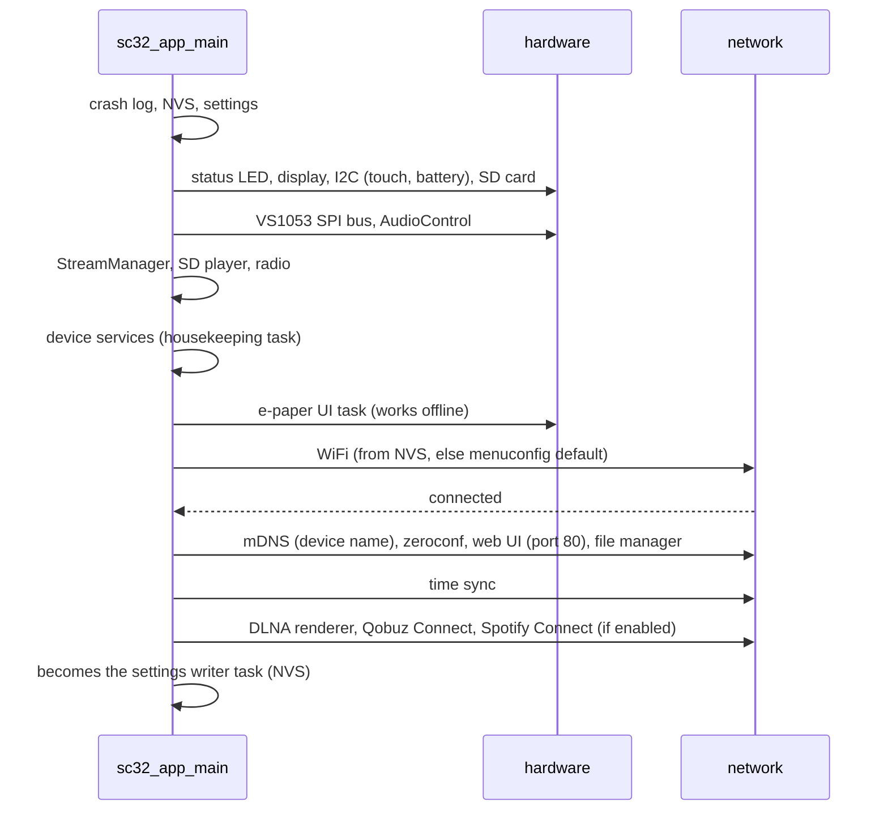

# Architecture

StreamCore32 is a set of ESP-IDF components. `targets/esp32` is only the
project shell; everything happens in [`sc_app`](../components/sc_app/README.md),
which builds the parts that are enabled in menuconfig and wires them together.

## Overview

| Part | What it is |
|---|---|
| [streamcore](../components/streamcore/README.md) | `StreamBase` (common control API), `AudioControl`, web UI server, zeroconf, logging, time, credential storage |
| [sc_app](../components/sc_app/README.md) | the application: start-up, `StreamManager`, settings, WiFi, device services, crash log, status LED, e-paper UI glue, web UI messages |
| [sc_spotify](../components/sc_spotify/README.md) | Spotify Connect (derived from cspot) |
| [sc_qobuz](../components/sc_qobuz/README.md) | Qobuz Connect |
| [sc_webstream](../components/sc_webstream/README.md) | internet radio (ICY / polled metadata, playlists) |
| [sc_sdfile](../components/sc_sdfile/README.md) | SD card player (gap-less, tags, seeking, playlists) |
| [sc_dlna](../components/sc_dlna/README.md) | DLNA / UPnP media renderer |
| [bell](../components/bell/README.md) | reduced feelfreelinux/bell: HTTP(S), sockets, utilities, nanopb, **VS1053 driver** |
| [sc_sdcard](../components/sc_sdcard/README.md) | SD card (SDMMC, hot plug) |
| [gdey027t91](../components/gdey027t91/README.md) | 2.7" e-paper driver |
| [ft6x36](../components/ft6x36/README.md) | touch controller |
| [bq27220](../components/bq27220/README.md) | battery fuel gauge |
| [i2c_bus](../components/i2c_bus/README.md) | shared I2C bus |
| [eink_ui](../components/eink_ui/README.md) | header-only e-paper UI toolkit |
| [eink_vg](../components/eink_vg/README.md) | vector icons (SVG → bytecode) |
| [Adafruit-GFX](../components/Adafruit-GFX/README.md) | graphics primitives and fonts |

Each source component has its own diagram in its README.

## The common stream interface

Every source derives from `StreamBase` (streamcore). The rest of the firmware
(web UI, e-paper UI, StreamManager) only uses that interface, so a new source
needs no UI code:

A source that cannot do something says so in `capabilities()`; the UIs hide
or grey out that control.

## Audio path

All sources hand the *encoded* audio (MP3, AAC, FLAC, Ogg Vorbis, WAV, WMA,
MIDI) to the VS1053, which decodes it. There is no software decoder.

The state callback is how the sources know which track is audible (and
keep the position clock and "now playing" right with several tracks queued).

## Start-up

## Threads

| Task | Stack | Does |
|---|---|---|
| main → settings writer | internal | NVS writes (settings, WiFi, stations) — flash work needs an internal stack |
| VS1053 feeder | | SDI transfers, sink state, commands |
| Spotify / Qobuz / radio / SD / DLNA reader | mostly PSRAM | network or SD → `feedData()` |
| web server (civetweb) + WebSocket sender | PSRAM | web UI, file manager |
| e-paper UI | PSRAM | touch, drawing, polling the active stream |
| housekeeping | PSRAM | SD hot plug, crash log, heap / CPU statistics |
| dlna_net / dlna_evt | PSRAM | SSDP + HTTP, GENA events |
| status LED, battery, spectrum (UDP) | small | |

Tasks with a PSRAM stack must not write flash; they hand that work to the
settings task (`Settings::runLater`).
