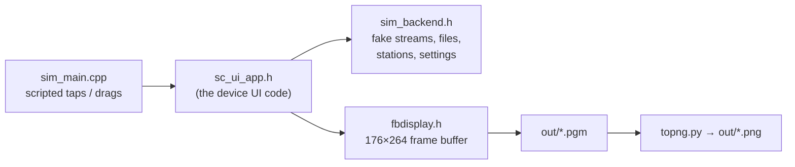

# scui_sim — e-paper UI on a PC

Builds the real e-paper UI (`sc_app/include/sc_ui_app.h`, `eink_ui`,
`eink_vg`) against a fake backend and a frame-buffer display, clicks through
all pages, saves a picture of each and checks the touch handling.



Needs g++, bash and Python 3 with Pillow (`pip install pillow`).

```shell
./build.sh               # also generates gen/vg_assets.h from the SVG icons
./scui_sim out           # pictures in out/, prints OK / FAIL per check
python3 topng.py out 2   # PNGs, 2x zoom  (Windows: python)
```

The run ends with `ALL PASSED (0 failures)`. Windows: Git Bash with MinGW
g++ or MSYS2 works (`stubs/` provides what the Arduino core would).
`SIM_CFLAGS=-DEINKUI_NO_FONTS ./build.sh` builds with the classic 5×7 font.
